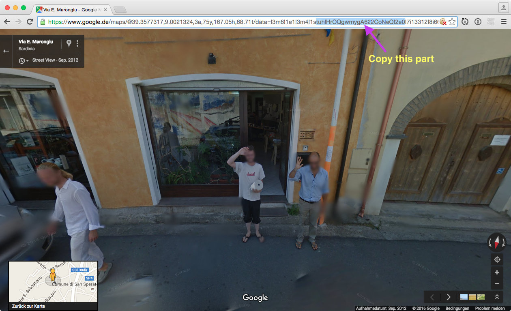

# Street View Panorama Download
Bash script – Downloads tiles from Google Street View to sub-folder & stitches them to a panoramic image

Props to http://www.newtonscannon.com/2014/01/26/capturing-spherical-scenes-from-google-streetview/

## Install/Prerequisites
* [Curl](https://curl.haxx.se/download.html)
* [GraphicsMagick](http://www.graphicsmagick.org/README.html)

## Usage (short version)

`sh streetviewdownload.sh <PANORAMAID>`

## Usage (long version): 
1. Enter Street View in Browser
2. Copy part of the URL between `1s` and `!` (see Screenshot) – this is the panorama id
3. Open Terminal.app
4. Navigate to the Folder where you put `streetviewdownload.sh`
5. Run `sh streetviewdownload.sh <PANORAMAID>` (without the <>)

## Disclaimer

Google may not be happy. 